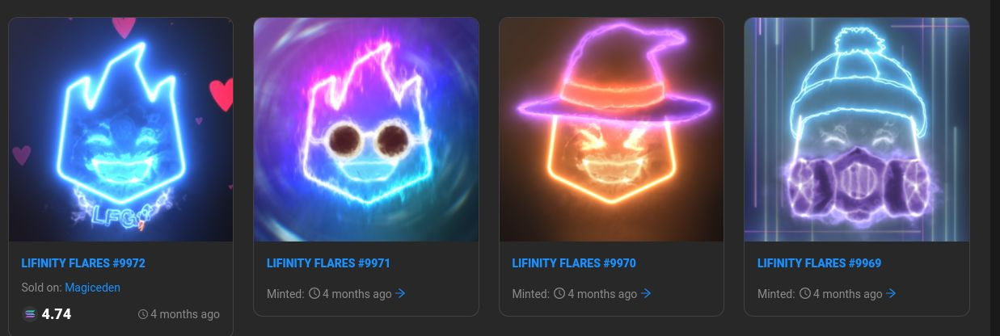
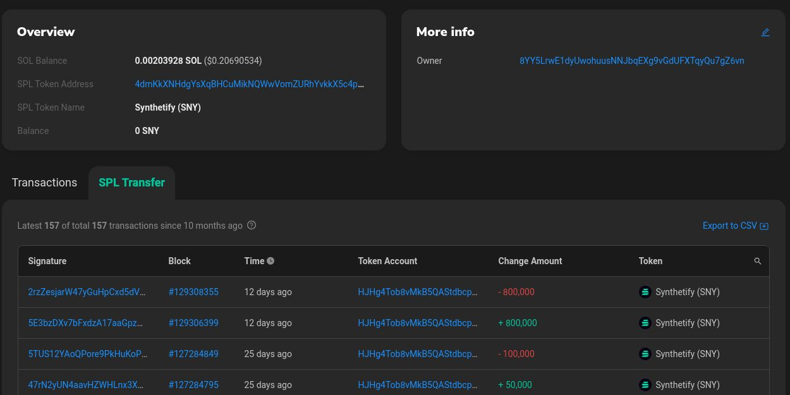
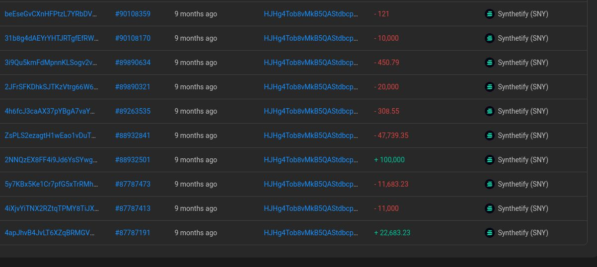
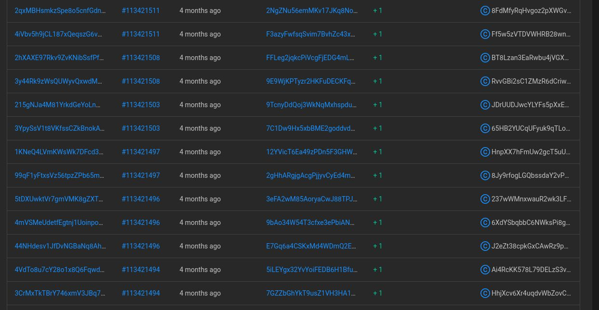

# On the wash trading of Lifinity Flares

We present evidence on the wash trading of NFT by people directly behind [Lifinity](lifinity.io). The team minted a large number of their own NFTs on the day of the public mint to decieve investors by create FOMO and inflated demand in the secondary market. A [single wallet](https://solscan.io/account/8YY5LrwE1dyUwohuusNNJbqEXg9vGdUFXTqyQu7gZ6vn) suspected to be belong to a core member of Lifinity and Synthetify alone minted 1150 of the 10,000 NFTs.

[Wash trading is a crime](https://en.wikipedia.org/wiki/Wash_trade) in regulated markets.

## Analyzing the data

1. 5346 out of 10,000 NFTs were never touched after the mint. Note how a lot of NFTs carry the "minted 4 months ago" on Solscan, as opposed to "sold on magiceden"



2. The top 10 holders have 33.18% of the Lifinity Flares. The top 5 being-

| Address                                      | Flares held |
|----------------------------------------------|-------------|
| 8YY5LrwE1dyUwohuusNNJbqEXg9vGdUFXTqyQu7gZ6vn | 1150        |
| GQ7Wdm1Uj1NDbCeGhGReMKvd59Zzvr9hvmyY39pS1cmc | 872         |
| 9M7ttEPYsx4eYRxPxQYCEdARSEegLV6UntmL2kDqvioT | 345         |
| 52jTdrpRwiYGtMSUMnCFhcCjdEUMJRFSrb3YxQGiN1Vx | 190         |
| sfgt6jXbjoT4DV9WysSkHY5Xyt88rBBNvddytuhWA67  | 182         |

3. There's clear evidence that [8YY5LrwE1dyUwohuusNNJbqEXg9vGdUFXTqyQu7gZ6vn](https://solscan.io/account/8YY5LrwE1dyUwohuusNNJbqEXg9vGdUFXTqyQu7gZ6vn) which bought 1150 flares is Norbert Bodziony or a close asssociate of Synthetify.

    1. https://solscan.io/account/HJHg4Tob8vMkB5QAStdbcp8NeXV5HtMP5E3kUNJSaD6r is the $SNY token account for this wallet. The oldest transactions are 10 month old, coinciding with Synthetify's launch.

        

        

    2. Wash minting of 1150 Flares by [8YY5LrwE1dyUwohuusNNJbqEXg9vGdUFXTqyQu7gZ6vn](https://solscan.io/account/8YY5LrwE1dyUwohuusNNJbqEXg9vGdUFXTqyQu7gZ6vn)-

        


    3. It is likely that #2 and other addresses are shell accounts to buy more flares.


## Methodology

1. Fetch JSON data of the [Flares collection from Solscan](https://solscan.io/collection/e68bf9abf20e179549afa0205087a6f449db4527b575df0adb589542ac52fd52). Due to API constraints, we had to set a limit of 1000 per call and paginate 10 times. Responses are stored in the ./data folder


```sh
curl https://api.solscan.io/collection/nft?sortBy=nameDec&collectionId=e68bf9abf20e179549afa0205087a6f449db4527b575df0adb589542ac52fd52&offset=0&limit=1000
```

2. Run [1-get-whales.js](1-get-whales.js). This script loops through the collection to-

    1. Find NFTs with a trade count of 0, i.e. those which were never listed on an NFT marketplace such as Solscan.
    2. Find the owner of each NFT using

    ```
    curl https://api.solscan.io/token/holders?token=${mint}&offset=0&size=1
    ```

3. Give the script some time. A map of owner address to ownership count is printed on console. The results are saved in [unsold-owners.js](unsold-owners.js).

4. Run [2-biggest-whales.js](2-biggest-whales.js) to get the top 10 holders.